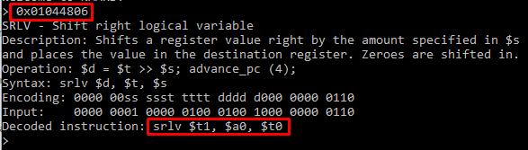

# NMAPS
MIPS32 disassembler on .NET Core  
It accepts 32-bit hex number through stdin and then decodes it into MIPS32 instruction equivalent
  
## What's this?
This is a console app to disassemble hex instruction (it also shows short description, syntax and encoding).  

## Supported instructions
Basic MIPS32 instructions that are described [here](http://www.mrc.uidaho.edu/mrc/people/jff/digital/MIPSir.html).

## How to run it?
Simply type this command in the root of this repo:

    dotnet run --project Nmars
